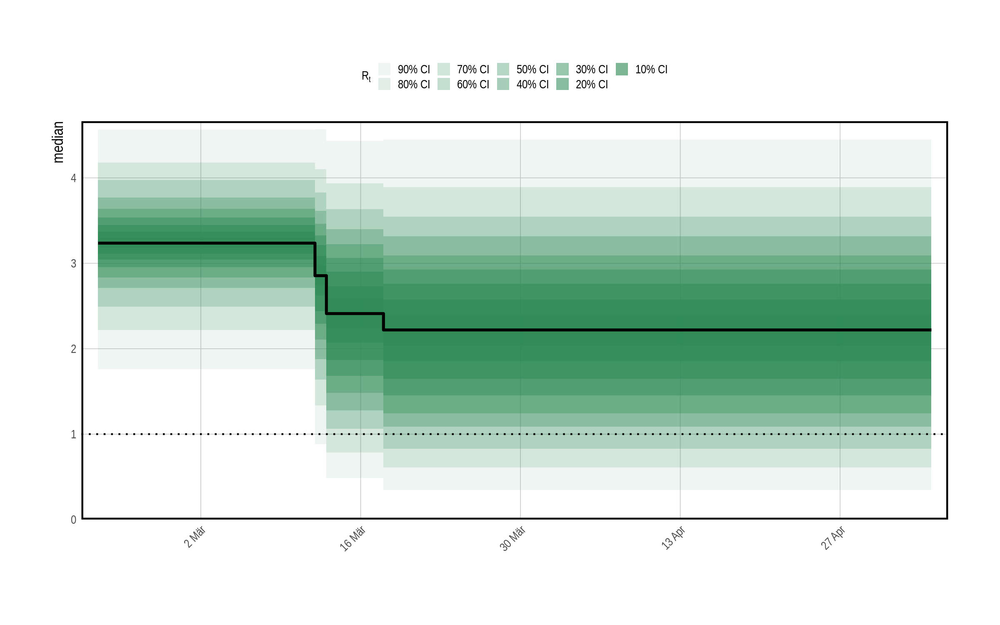
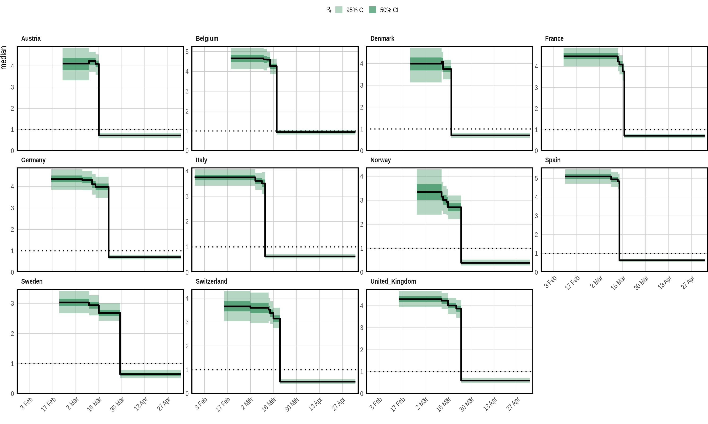
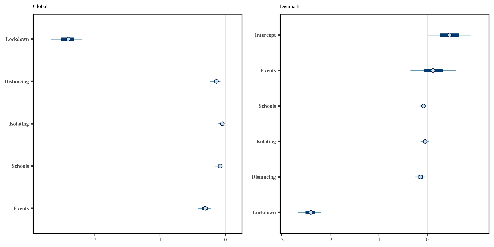
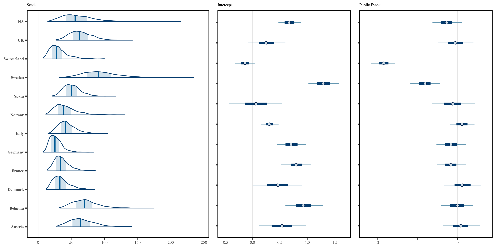
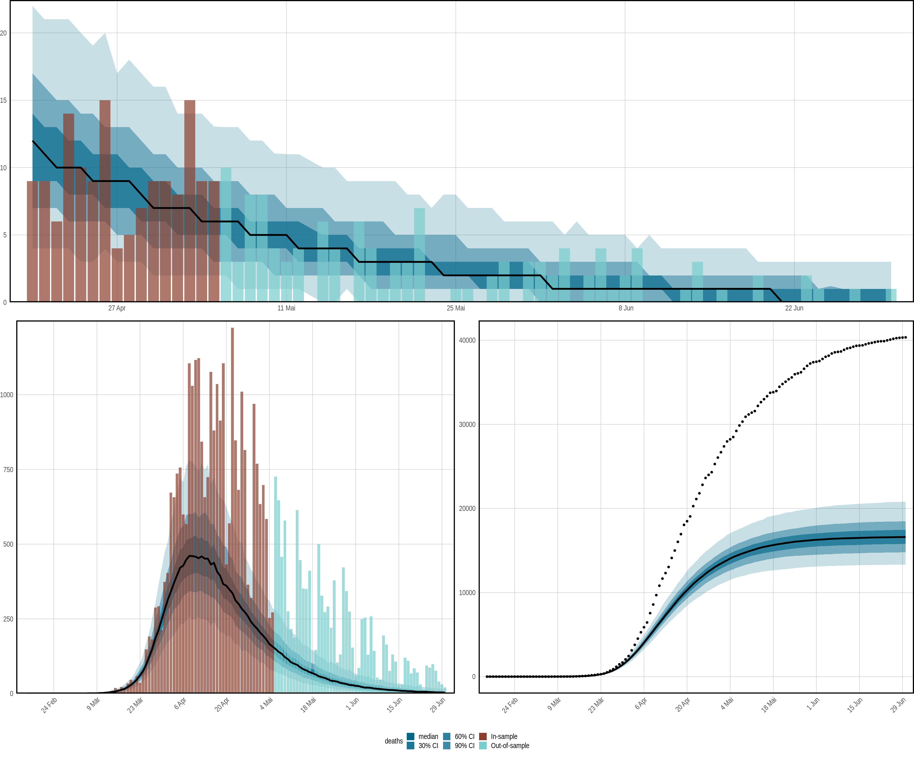

Effect of non-pharmaceutical interventions
================
Imperial College London

# Assessing the Effects of Interventions on COVID-19

This tutorial is taken of the example from
[epidemia](https://imperialcollegelondon.github.io/epidemia/articles/europe-covid.html)
and for mathematical details, we refer to the model
[description](https://imperialcollegelondon.github.io/epidemia/articles/model-description.html).

Our aim is to introduce the semi-mechanistic modelling approach of
**epidemia** with a realistic research question: How effective are
non-pharmaceutical interventions? We consider the same setup as in
[Flaxman et al.](https://www.nature.com/articles/s41586-020-2405-7),
where the authors estimate the effect of a set of measures that have
been implemented during the first wave of the Covid-19 pandemic in 11
European countries. The approach implements partial pooling of
parameters in order to minimize country-specific biases and improve
inference. As observations we rely on the number of daily deaths.

``` r
library(dplyr)
library(epidemia)
library(rstanarm)
```

## Data

The data contains daily case and death counts as provided by
**epidemia** together with five time series with binary elements that
indicate the presence of a non-pharamaceutical intervention. These
include: - closing of schools and universities - banning of public
events - encouraging social distancing - requiring self isolation if ill
- full lockdown.

``` r
data("EuropeCovid")
data <- EuropeCovid$data
head(data)
```

    ## # A tibble: 6 × 9
    ## # Groups:   country [1]
    ##   country date       schools_universit… self_isolating_i… public_events lockdown
    ##   <fct>   <date>                  <int>             <int>         <int>    <int>
    ## 1 Austria 2020-02-22                  0                 0             0        0
    ## 2 Austria 2020-02-23                  0                 0             0        0
    ## 3 Austria 2020-02-24                  0                 0             0        0
    ## 4 Austria 2020-02-25                  0                 0             0        0
    ## 5 Austria 2020-02-26                  0                 0             0        0
    ## 6 Austria 2020-02-27                  0                 0             0        0
    ## # … with 3 more variables: social_distancing_encouraged <int>, deaths <int>,
    ## #   pop <int>

Following [Flaxman et
al.](https://www.nature.com/articles/s41586-020-2405-7), we seed the
infection 30 days prior to observing 10 cumulative deaths:

``` r
data <- filter(data, date > date[which(cumsum(deaths) > 10)[1] - 30])
dates <- summarise(data, start = min(date), end = max(date))
head(dates)
```

    ## # A tibble: 6 × 3
    ##   country start      end       
    ##   <fct>   <date>     <date>    
    ## 1 Austria 2020-02-23 2020-05-05
    ## 2 Belgium 2020-02-19 2020-05-05
    ## 3 Denmark 2020-02-22 2020-05-05
    ## 4 France  2020-02-09 2020-05-05
    ## 5 Germany 2020-02-16 2020-05-05
    ## 6 Italy   2020-01-28 2020-05-05

### Model Components

The model setup requires the user to define three components: - a
transmission model - an infection model - an observation model

#### Transmission

We model the reproduction number as a generalized linear model with a
link function that bounds the potential outcome to a reasonable interval
and NPIs as predictors. This gives a step-wise linear approximation for
the reproduction Number. Programmatically, we express the transmission
model as:

``` r
rt <- epirt(formula = R(country, date) ~ 0 + (1 + public_events + 
              schools_universities + self_isolating_if_ill + 
              social_distancing_encouraged + lockdown || country) + 
              public_events + schools_universities + self_isolating_if_ill +
              social_distancing_encouraged + lockdown, 
            prior = shifted_gamma(shape = 1/6, scale = 1, shift = log(1.05)/6),
            prior_covariance = decov(shape = c(2, rep(0.5, 5)), scale = 0.25),
            link = scaled_logit(6.5))
```

All country-specific parameters are partially pooled by letting.
However, the operator `||` is used rather than `|` for random effects.
This ensures that all effects for a given country are independent. The
argument `prior` gives a shifted Gamma distribution as priors for the
fixed effect, i.e. the mean effect size across all countries. The
`shift` reflects our expectation that NPIs will likely reduce
transmission. We further control the covariance of the random (pooled)
effects with `prior_covariance`. Since country effects are assumed
independent, the `decov` prior reduces to assigning Gamma priors will
scale = 0.25 to all country specific parameters. By using a vector
rather than a scalar for the `shape` argument, we are able to give the
prior on the country specific intercepts a larger shape parameter.

### Infections

Infections are kept simple here by using the basic version of the model.
That is to say that infections are taken to be a deterministic function
of seeds and reproduction numbers, propagated by the renewal process.
Extensions to modeling infections as parameters and adjustments for the
susceptible population are not considered. The model is defined as
follows.

``` r
inf <- epiinf(gen = EuropeCovid$si, seed_days = 6)
```

`EuropeCovid$si` is a numeric vector giving the serial interval used in
[Flaxman et al.](https://www.nature.com/articles/s41586-020-2405-7). As
in that work, we make no distinction between the generation distribution
and serial interval here.

### Observations

In order to infer the effects of control measures on transmission, we
must fit the model to data. Here, daily deaths are used. In theory,
additional types of data can be included in the model, but such
extension are not considered here. A simple intercept model is used for
the infection fatality rate (IFR). This makes the assumption that the
IFR is constant over time. The model can be written as follows.

``` r
deaths <- epiobs(formula = deaths ~ 1, i2o = EuropeCovid2$inf2death, 
                 prior_intercept = normal(0,0.2), link = scaled_logit(0.02))
```

By using `link = scaled_logit(0.02)`, we let the IFR range between 0%
and 2%. In conjunction with the symmetric prior on the intercept, this
gives the IFR a prior mean of 1. `EuropeCovid2$inf2death` is a numeric
vector giving the same distribution for the time from infection to death
as that used in [Flaxman et
al.](https://www.nature.com/articles/s41586-020-2405-7).

## Model Fitting

In general, **epidemia**’s models should be fit using Hamiltonian Monte
Carlo. For this example, however, we use Variational Bayes (VB) as
opposed to full MCMC sampling. This is because full MCMC sampling of a
joint model of this size is computationally demanding, due in part to
renewal equation having to be evaluated for each region and for each
evaluation of the likelihood and its derivatives. Nonetheless, VB allows
rapid iteration of models and may lead to reasonable estimates of effect
sizes. For this example, we have also run full MCMC, and the inferences
reported here are not substantially different.

### Prior Check

It is also useful to do prior predictive checks as these allow the user
to catch obvious mistakes that can occur when specifying the model, and
can also help to affirm that the prior is in fact reasonable.

In **epidemia** we can do this by using the `priorPD = TRUE` flag in
`epim()`. This discards the likelihood component of the posterior,
leaving just the prior. We use Hamiltonian Monte Carlo over VB for the
prior check, partly because sampling from the prior is quick (it is the
likelihood that is expensive to evaluate). In addition, we have defined
Gamma priors on some coefficients, which are generally poorly
approximated by VB.

``` r
args <- list(rt = rt, inf = inf, obs = deaths, data = data, seed = 12345, 
             refresh = 0)
pr_args <- c(args, list(algorithm = "sampling", iter = 1e3, prior_PD = TRUE))
fm_prior <- do.call(epim, pr_args)
```

Figure @ref(fig:multilevel-prior) shows samples of the reproduction
number given the prior distribution. This confirms that reproduction
numbers follow a step function, and that rates can both increase and
decrease as measures come into play.

<div class="figure" style="text-align: center">


<p class="caption">
A prior predictive check for reproduction numbers *R*<sub>*t*</sub> in
the multilevel model. Only results for the United Kingdom are presented
here. The prior median is shown in black, with credible intervals shown
in various shades of green. The check appears to confirm that
*R*<sub>*t*</sub> follows a step-function.
</p>

</div>

### Approximating the Posterior

The model will be fit using Variational Bayes by using
`algorithm = "fullrank"` in the call to `epim()`. This is generally
preferable to `"meanfield"` for these models, largely because
`"meanfield"` ignores posterior correlations. We decrease the parameter
`tol_rel_obj` from its default value, and increase the number of
iterations to aid convergence.

``` r
args$algorithm <- "fullrank"; args$iter <- 5e4; args$tol_rel_obj <- 1e-3
fm <- do.call(epim, args)
```

A first step in evaluating the model fit is to perform posterior
predictive checks. This is to confirm that the model adequately explains
the observed daily deaths in each region. This can be done using the
command `plot_obs(fm, type = "deaths", levels = c(50, 95))`. The plot is
shown in Figure @ref(fig:multilevel-obs-plots).

<div class="figure" style="text-align: center">


<p class="caption">
Posterior predictive checks. Observed daily deaths (red) is plotted as a
bar plot. Credible intervals from the posterior are plotted in shades of
blue, in addition to the posterior median in black. Each panel shows the
data for a single country.
</p>

</div>

Figure @ref(fig:multilevel-obs-plots) suggest that the epidemic was
bought under control in each group considered. Indeed, one would expect
that the posterior distribution for reproduction numbers lies largely
below one in each region. Figure @ref(fig:multilevel-rt-plots) is the
result of `plot_rt(fm, step = T, levels = c(50,95))`, and confirms this.

<div class="figure" style="text-align: center">


<p class="caption">
Inferred reproduction numbers in each country. Credible intervals from
the posterior are plotted in shades of green, in addition to the
posterior median in black. Each panel shows the data for a single
country.
</p>

</div>

## Effect Sizes

<hr>

In **epidemia**, estimated effect sizes can be visualized using the
`plot.epimodel` method. This serves a similar purpose to `plot.stanreg`
in **rstanarm**, providing an interface to the **bayesplot** package.
The models in **epidemia** often have many parameters, some of which
pertain to a particular part of the model (i.e. transmission), and some
which pertain to particular groups (i.e., country-specific terms).
Therefore `plot.epimodel` has arguments `par_models`, `par_types` and
`par_groups`, which restrict the parameters considered to particular
parts of the model.

As an example, credible intervals for the global coefficients
*β*<sub>*i*</sub> can be plotted using the command
`plot(fm, par_models = "R", par_types = "fixed")`. This leads to the
left plot in Figure @ref(fig:multilevel-effects-plots).

Figure @ref(fig:multilevel-effects-plots) shows a large negative
coefficient for lockdown, suggesting that this is on average the most
effective intervention. The effect of banning public events is the next
largest, while the other policy effects appear closer to zero. Note that
the left plot in Figure @ref(fig:multilevel-effects-plots) shows only
global coefficients, and does not show inferred effects in any given
country. To assess the latter, one must instead consider the quantities
*β*<sub>*i*</sub> + *b*<sub>*i*</sub><sup>(*m*)</sup>. We do this by
extracting the underlying draws using `as.matrix.epimodel`, as is done
below for Italy.

``` r
beta <- as.matrix(fm, par_models = "R", par_types = "fixed")
b <- as.matrix(fm, regex_pars = "^R\\|b", par_groups = "Denmark")
mat <- cbind(b[,1], beta + b[,2:6])
labels <- c("Events", "Schools", "Isolating", "Distancing", "Lockdown")
colnames(mat) <- c("Intercept", labels)
```

<div class="figure" style="text-align: center">


<p class="caption">
**Left**: Global Effect sizes for the five policy measures considered.
**Right**: Effect sizes specific to Italy. The global and
country-specific effects may differ because the effects are *partially
pooled*.
</p>

</div>

Calling `bayesplot::mcmc_intervals(mat)` leads to the results shown in
the right panel of Figure @ref(fig:multilevel-effects-plots).

Figure @ref(fig:multilevel-effects-plots) has relatively narrow
intervals for many of the effect sizes. This appears to be an artifact
of using Variational Bayes. In particular, when repeating this analysis
with full MCMC, we observe that the intervals for all policies other
than lockdown overlap with zero.

Consider now the role of partial pooling in this analysis. Figure
@ref(fig:multilevel-rt-plots) shows that Sweden did enough to reduce *R*
below one. However, it did so without a full lockdown. Given the small
effect sizes for other measures, the model must explain Sweden using the
country-specific terms. Figure @ref(fig:multilevel-interval-plots) shows
estimated seeds, intercepts and the effects of banning public events for
each country. Sweden has a lower intercept than other terms which in
turn suggests a lower *R*<sub>0</sub> - giving the effects less to do to
explain Sweden. There is greater variability in seeding, because the
magnitude of future infections becomes less sensitive to initial
conditions when the rate of growth is lower. Figure
@ref(fig:multilevel-interval-plots) shows that the model estimates a
large negative coefficient for public events in Sweden. This is
significantly larger then the effects for other policies - which are not
reported here. However, the idiosyncrasies relating to Sweden must be
explained in this model by at least one of the covariates, and the large
effect for public policy in Sweden is most probably an artifact of this.
Nonetheless, the use of partial pooling is essential for explaining
difference between countries. If full pooling were used, effect sizes
would be overly influenced by outliers like Sweden. This argument is
made in more detail in @Flaxman2020MA.

<div class="figure" style="text-align: center">


<p class="caption">
**Left**: Inferred daily seeded infections in each country. These have
been assumed to occur over a period of 6 days. **Middle**: Estimated
Intercepts in the linear predictor for reproduction numbers. **Right**:
Country-specific effect sizes corresponding to the banning of public
events.
</p>

</div>

## Forecasting

<hr>

Forecasting within **epidemia** is straightforward, and consists of
constructing a new data frame which is used in place of the original
data frame. This could, for example, change the values of covariates, or
alternatively include new observations in order to check the
out-of-sample performance of the fitted model.

Recall that `EuropeCovid2` holds daily death data up until the end of
June 2020, however we only fitted the model up until the 5<sup>th</sup>
May. The following constructs a data frame `newdata` which contains the
additional observations. Note that we are careful to select the same
start dates as in the original data frame.

``` r
newdata <- EuropeCovid2$data
newdata <- filter(newdata, date > date[which(cumsum(deaths) > 10)[1] - 30])
```

This data frame can be passed to plotting functions `plot_rt()`,
`plot_obs()`, `plot_infections()` and `plot_infectious()`. If the raw
samples are desired, we can also pass as an argument to
`posterior_rt()`, `posterior_predict()` etc. The top panel of Figure
@ref(fig:multilevel-counterfactuals) is the result of using the command
`plot_obs(fm, type = "deaths", newdata = newdata, groups = "Italy")`.
This plots the out of sample observations with credible intervals from
the forecast.

## Counterfactuals

Counterfactual scenarios are also easy. Again, one simply has to modify
the data frame used. In this case we shift all policy measures back
three days.

``` r
shift <- function(x, k) c(x[-(1:k)], rep(1,k))
days <- 3

newdata <- mutate(newdata,
  lockdown = shift(lockdown, days),
  public_events = shift(public_events, days),
  social_distancing_encouraged = shift(social_distancing_encouraged, days),
  self_isolating_if_ill = shift(self_isolating_if_ill, days),
  schools_universities = shift(schools_universities, days)
)
```

The bottom panel of Figure @ref(fig:multilevel-counterfactuals)
visualizes the counterfactual scenario of all policies being implemented
in the UK three days earlier. Deaths are projected over both the
in-sample period, and the out-of-sample period. The left plot is
obtained using
`plot_obs(fm, type = "deaths", newdata = newdata, groups = "United_Kingdom")`,
while the right plot adds the `cumulative = TRUE` argument. We reiterate
that these results are not intended to be fully rigorous: they are
simply there to illustrate usage of **epidemia**.

<div class="figure" style="text-align: center">


<p class="caption">
Forecasts and counterfactual scenarios. All results pertain to the
United Kingdom. **Top**: An out-of-sample forecast for daily deaths.
**Bottom:** Results corresponding to a a counterfactual whereby all
policies were implemented 3 days earlier. The left plot shows credible
intervals for daily deaths under this scenario. The right presents
cumulative deaths. The black dotted line shows observed cumulative
deaths.
</p>

</div>
